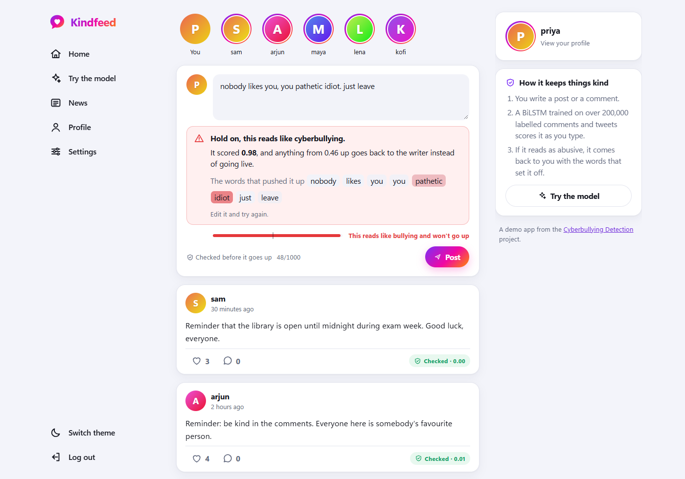
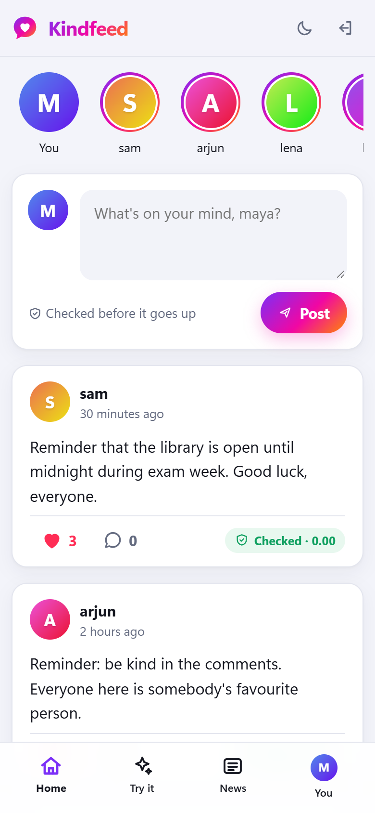
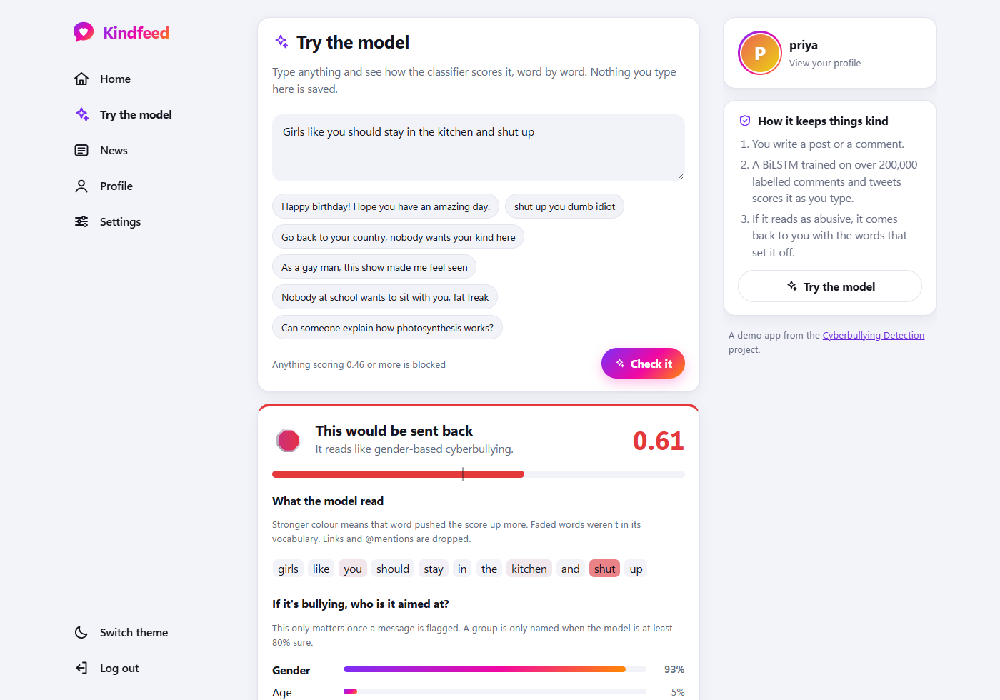

# Cyberbullying Detection

[](https://github.com/prathambharati/Cyberbullying-Detection/actions/workflows/tests.yml)

**Kindfeed** is a small social app that stops cyberbullying before it's posted. Every post and comment goes through
a BiLSTM classifier first. If it reads as abusive, the writer gets it back, with the words that set it off
highlighted and what the abuse seems to be aimed at: age, ethnicity, gender, religion or something else. A meter
under the text box warns you while you're still typing.

It also has two ways to log in with a webcam: face recognition in the browser, and a hands-free PIN you type in
Morse code by blinking.



<p align="center">
  
  &nbsp;&nbsp;
  
</p>

## What's in here

- **A social feed.** Post, comment and like, with stories of who's been active, profile pages, a heart burst when you double-click a post, a light and a dark theme, and a phone layout with a bottom tab bar.
- **Moderation you can see.** Anything the model flags goes back to the writer and is never saved. The notice says why and highlights the words that pushed the score up, and a live meter warns you before you even hit Post.
- **A classifier with two heads.** One decides whether to block a message. The other says who the abuse targets.
- **A model playground.** The "Try the model" page scores any text word by word, with one-click examples. There's a JSON API too.
- **Face and PIN login.** In the browser, your face (checked with OpenCV's SFace model) plus a typed PIN. In the desktop tool, your face plus a PIN you blink.
- **A news page** with today's top stories from the Times of India.
- **A reproducible training script** that downloads its own data, checks every file's hash and writes a model card with test scores.
- **122 tests**, run on every push by GitHub Actions, plus a script that clicks through the whole app in Chrome.

## Quick start

You need Python 3.10 to 3.13.

```bash
git clone https://github.com/prathambharati/Cyberbullying-Detection.git
cd Cyberbullying-Detection
python -m venv .venv
.venv\Scripts\activate            # on macOS or Linux: source .venv/bin/activate
pip install -r requirements.txt

flask --app cyberbullying.web seed    # optional: five demo people with posts, comments and likes
flask --app cyberbullying.web run
```

Then open http://127.0.0.1:5000. The trained model is already in `models/`, so there's nothing to train first.
The demo accounts are maya, sam, arjun, lena and kofi, all with the password `demo-password`. To give the app a
different name, set `CB_APP_NAME` before starting it.

To turn on face login, download the face and eye models (43 MB) and restart the app:

```bash
python -m cyberbullying.downloads
```

On Linux, OpenCV and MediaPipe need a few system libraries that minimal installs (servers, Docker) leave out:
`sudo apt install libgl1 libglib2.0-0 libegl1 libgles2 libportaudio2`.

## How the classifier works

The model answers two questions, and each one is learned from a different dataset.

| Question | Learned from | Output |
| --- | --- | --- |
| Should this be blocked? | [Jigsaw toxic comments](https://www.kaggle.com/c/jigsaw-toxic-comment-classification-challenge) (160k Wikipedia comments), [OLID](https://sites.google.com/site/offensevalsharedtask/olid) (14k tweets) and [Measuring Hate Speech](https://huggingface.co/datasets/ucberkeley-dlab/measuring-hate-speech) (40k comments about identities, hateful and supportive) | A score from 0 to 1. At 0.46 or above, the post is blocked. |
| What is it about? | The [cyberbullying tweets dataset](https://www.kaggle.com/datasets/andrewmvd/cyberbullying-classification) (47k tweets) and the targets annotated in Measuring Hate Speech | Age, ethnicity, gender, religion or other |

### Why not train on the cyberbullying tweets alone?

An earlier version of this model did exactly that, with the same BiLSTM, and it looked great on paper: 0.87 macro
F1 and 0.95 ROC AUC on the dataset's own test split. Then it was tried on messages written by hand. It let through
"Kill yourself, the world would be better without you" (score 0.35) and "Go back to your country, nobody wants your
kind here" (0.20), and gave "My grandma just learned how to video call us, she is adorable" a higher score (0.76)
than either.

The reason is how the dataset was built. Each class was collected with keywords, so many "age" tweets are people
talking about being bullied at school, and the model learned topics (school, religion, women) instead of abuse.
The fix was to learn *whether* something is abusive from data labelled for exactly that, and keep the tweets for
what they're good at: telling you what kind of bullying it is once something is flagged.

Jigsaw and OLID fixed most of it, but a second round of hand-written checks found two gaps, both about
identities. That version let through attacks that contain no swear words ("Jews control the media and the banks"
scored 0.18), and it flagged "As a gay man, this show made me feel seen" (0.63) because identity words show up so
often in abusive comments. The Measuring Hate Speech corpus targets both: its hateful comments are identity attacks
of every kind, and its supportive comments mention the same identities in a friendly way.

The training script now ends every run with a spot check of 34 hand-written messages, including those
identity cases, so failures like these show up straight away. The current model gets 32 of them right.

### The model

- **Tokenizer.** Lowercases, drops links and @mentions, and splits contractions the way GloVe does ("don't" becomes "do" + "n't"), so they line up with pretrained vectors. It keeps `!`, `?`, emoji and censored words like "f*ck" whole.
- **Embeddings.** 30,000 words, initialised from 100 dimensional [GloVe](https://nlp.stanford.edu/projects/glove/) vectors (93% of the vocabulary has one) and fine tuned.
- **Encoder.** A bidirectional LSTM with 64 units each way, with dropout.
- **Two heads.** A sigmoid for "harmful" and a softmax over the five kinds. Each training example only updates the head it has a label for.
- **Naming the target.** A generic insult has no target, but a softmax always picks one, so the app only names a kind when the head is at least 80% sure and calls it "other" otherwise. On the validation set that names the target for 89% of targeted abuse, and 96% of those names are right.
- **Long posts.** The model reads 128 tokens at a time. Longer posts are split into overlapping windows and judged by their worst window, so an insult at the end of a long comment still gets caught.
- **Threshold.** Chosen on the validation set to maximise F1 for "harmful".
- **Explaining a decision.** Each word is left out in turn and the rest is scored again. How far the score drops is that word's weight, and that's what the highlights in the app show. It's a simple method, but it only uses what the model actually does.

Duplicates are removed before splitting, tweets that appear under two different labels are dropped (3,495 of them),
hate speech comments in the corpus's ambiguous middle band are left out (11,736 of them), and any test text
that also appears in training is taken out, so the scores below aren't inflated by text the model has seen.

## Results

All numbers are on held-out test data the model never saw during training or threshold tuning, next to a
TF-IDF + logistic regression baseline trained on the same splits. They come straight from
[`models/model_card.json`](models/model_card.json).

**Should this be blocked?** (threshold 0.46)

| Test set | Model | ROC AUC | Precision | Recall | F1 | Harmless texts flagged |
| --- | --- | --- | --- | --- | --- | --- |
| All (66,994) | **BiLSTM** | 0.958 | 0.532 | 0.872 | 0.661 | 9.6% |
|  | TF-IDF + LR | 0.951 | 0.550 | 0.814 | 0.656 | 8.4% |
| Jigsaw comments (63,378) | BiLSTM | 0.961 | 0.507 | 0.882 | 0.644 | 9.3% |
|  | TF-IDF + LR | 0.954 | 0.527 | 0.815 | 0.640 | 8.0% |
| OLID tweets (840) | BiLSTM | 0.861 | 0.720 | 0.573 | 0.638 | 8.6% |
|  | TF-IDF + LR | 0.804 | 0.634 | 0.556 | 0.592 | 12.4% |
| Measuring Hate Speech (2,776) | BiLSTM | 0.911 | 0.713 | 0.885 | 0.790 | 21.0% |
|  | TF-IDF + LR | 0.908 | 0.710 | 0.866 | 0.780 | 20.8% |

**What is it about?** (4,741 abusive texts with a known target)

| Test set | Model | Accuracy | Macro F1 |
| --- | --- | --- | --- |
| All (4,741) | BiLSTM | 0.928 | 0.927 |
| | TF-IDF + LR | 0.914 | 0.912 |
| Measuring Hate Speech (1,027) | BiLSTM | 0.828 | 0.598 |
| | TF-IDF + LR | 0.793 | 0.543 |
| Cyberbullying tweets (3,714) | BiLSTM | 0.956 | 0.952 |
| | TF-IDF + LR | 0.948 | 0.943 |

F1 by kind for the BiLSTM: age 0.98, ethnicity 0.93, gender 0.91, religion 0.96, other 0.86.

**Spot check.** 32 of 34 hand-written messages handled right: 12 of 14 abusive ones blocked, and all 20 harmless ones let through, including the 8 that mention an identity. The misses:

- "Black people are all criminals" scored 0.43 and was let through
- "Jews control the media and the banks" scored 0.29 and was let through

## Face and blink login

**In the browser.** On your account page, the camera takes three quick pictures. OpenCV's YuNet model finds your
face, and SFace turns it into 128 numbers. Only those numbers are saved, never a photo. To log in you give your
username and PIN, the camera takes three more pictures, and the app checks the median cosine similarity against
your saved face (0.363 or more counts as a match, the SFace authors' recommended cut-off). A wrong face and a wrong
PIN get the same error message, so the page doesn't reveal which one was off.

**Hands free, on the desktop.** `python -m cyberbullying.webcam login <username>` checks your face in a window, then
asks for your PIN in Morse code. Three keys light up in turn: dot, dash and delete. Close your eyes for half a second
while the one you want is lit. Ordinary blinks are shorter than that, so they don't count. Five dots and dashes make a
digit, the tool learns what your open eyes look like before it starts, and MediaPipe's face landmarker does the eye
tracking.

```bash
python -m cyberbullying.webcam enroll maya   # save a face from the webcam
python -m cyberbullying.webcam login maya    # face check, then blink the PIN
python -m cyberbullying.webcam pin           # just practise blink typing
```

The desktop tool and the web app share one database, so you can register in the browser and log in hands free.

## Other ways to use it

Score text from the command line:

```bash
python -m cyberbullying "nobody likes you, just leave"
```

Or through the JSON API while the app is running:

```bash
curl -X POST http://127.0.0.1:5000/api/score -H "Content-Type: application/json" \
     -d '{"texts": ["have a great day", "shut up you idiot"]}'
```

```json
{
  "results": [
    {
      "categories": {
        "age": 0.0232,
        "ethnicity": 0.0112,
        "gender": 0.1265,
        "other": 0.8203,
        "religion": 0.0188
      },
      "category": null,
      "is_bullying": false,
      "score": 0.0435
    },
    {
      "categories": {
        "age": 0.0172,
        "ethnicity": 0.0133,
        "gender": 0.0281,
        "other": 0.9256,
        "religion": 0.0159
      },
      "category": "other",
      "is_bullying": true,
      "score": 0.982
    }
  ],
  "threshold": 0.46
}
```

### Retraining

```bash
python -m cyberbullying.train
```

The first run downloads about 300 MB of data and vectors into `data/`, and every file is checked against a SHA-256
hash. A full run takes about an hour on a laptop CPU: roughly 10 minutes per epoch, and early stopping ended this
one after five epochs, keeping the weights from the third. The script prints the same tables as above and
overwrites the model in `models/`. `python -m cyberbullying.train --help` lists the options.

### Tests

```bash
pip install -r requirements-dev.txt
pytest
```

The route tests use stand-ins for the model and the face recognizer, so they're fast and don't depend on what the
model thinks. Separate tests run the real model, the real face models on public domain NASA portraits, and the whole
training script on a tiny made-up dataset.

To click through the running app in a real browser, using the Chrome you already have:

```bash
pip install playwright
python scripts/browser_check.py
```

It signs up, types, posts, likes, comments, switches theme and tries the phone layout, 29 checks in all, and fails
on any JavaScript error. `--screenshots docs` retakes the pictures in this README.

## Project layout

```text
cyberbullying/
  text.py          tokenizer and vocabulary
  data.py          loading, cleaning and splitting the four datasets
  model.py         the two-headed BiLSTM
  train.py         training, evaluation, baselines and the spot check
  classifier.py    loads the model and scores text
  face.py          face matching with YuNet and SFace
  blink.py         the Morse keypad you drive with your eyes
  morse.py         Morse code for digits
  webcam.py        desktop tools: enroll, face + blink login, blink practice
  news.py          headlines from the Times of India feed, with caching
  db.py            SQLite storage for users, posts, comments and likes
  downloads.py     fetches data and model files and checks their hashes
  web/             the Flask app: routes, templates, styles and scripts
models/            the trained classifier and its model card
scripts/           browser_check.py, the click-through test in Chrome
tests/             pytest suite and test data
```

## Privacy and security

- Passwords and PINs are stored as salted scrypt hashes (Werkzeug), never in plain text.
- Every form has a CSRF token, and sessions are reset at login.
- Face data is 128 numbers per user, not a photo, and users can delete it from their account page.
- Blocked posts are never written to the database. The live meter scores drafts as you type but doesn't keep them.
- Only the person who wrote a post can delete it.
- Links on the news page must be http or https, so a bad feed can't inject `javascript:` links.
- The secret key is generated per install and kept out of git, along with the database.

## Limitations

- **One message at a time.** Real cyberbullying is often a pattern across many messages. This only looks at one.
- **Its sense of harm comes from Wikipedia comments and tweets.** Other communities talk differently. Sarcasm, new slang and non-English text will trip it up.
- **Identity words can still raise the score.** All eight friendly identity mentions in the spot check get through, but 21% of the supportive comments in the Measuring Hate Speech test set are still flagged.
- **Some identity attacks slip through.** Two of the spot check's 14 abusive messages get past it (scores 0.43 and 0.29), and both are stereotypes with no insult or swear word in them.
- **The category is a hint, not a verdict.** It's right 96% of the time on the tweets but 83% on the hate speech comments, where rare kinds like age are much harder (macro F1 0.60).
- **Browser face login has no liveness check,** so a good photo could fool it. The PIN is required for that reason, and the blink tool is harder to fool.
- **Flask's development server.** For anything public, run it behind a proper WSGI server and add rate limiting on the login routes.

## Data and credits

- Jigsaw Toxic Comment Classification Challenge, labels under CC0 and comment text under CC BY-SA 3.0, via the [Hugging Face mirror](https://huggingface.co/datasets/thesofakillers/jigsaw-toxic-comment-classification-challenge).
- OLID, Zampieri et al., *Predicting the Type and Target of Offensive Posts in Social Media* (NAACL 2019), in the [TweetEval](https://github.com/cardiffnlp/tweeteval) release by Barbieri et al. (2020).
- Measuring Hate Speech corpus, Kennedy et al. (2020) and Sachdeva et al. (2022), UC Berkeley D-Lab, CC BY 4.0, from [Hugging Face](https://huggingface.co/datasets/ucberkeley-dlab/measuring-hate-speech).
- Cyberbullying tweets, Wang, Fu and Lu, *SOSNet: A Graph Convolutional Network Approach to Fine-Grained Cyberbullying Detection* (IEEE BigData 2020), via a [Hugging Face mirror](https://huggingface.co/datasets/poorvanshi04/cyberbullying_tweets.csv).
- GloVe, Pennington, Socher and Manning (2014).
- [YuNet and SFace](https://github.com/opencv/opencv_zoo) from OpenCV Zoo, and the [MediaPipe Face Landmarker](https://ai.google.dev/edge/mediapipe/solutions/vision/face_landmarker).
- The test portraits are public domain NASA photos. See [`tests/data/README.md`](tests/data/README.md).
